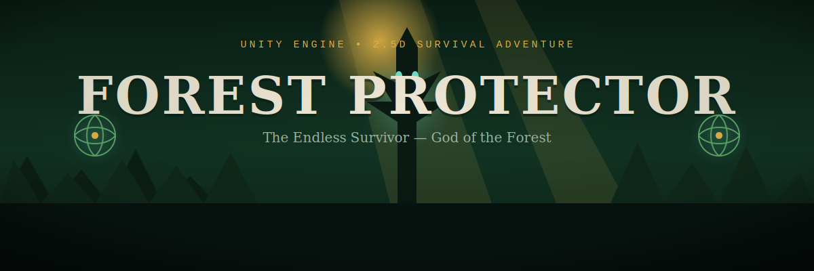
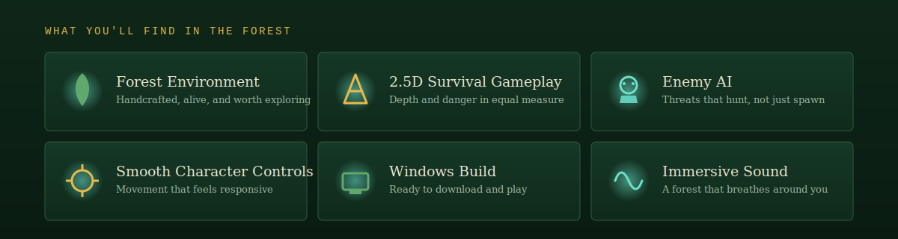
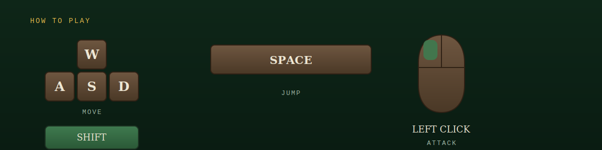

<div align="center">



<br/>

<p align="center">
<a href="YOUR_ITCH_IO_LINK">

</a>


</p>

</div>


## 🎮 About The Game

**Forest Protector 2.5 D** is a 2.5D survival action game where players protect the forest from dangerous enemies while exploring a handcrafted environment.

The project focuses on gameplay mechanics, smooth player movement, enemy AI, environmental storytelling, and polished Unity development.


## 📥 Download

### Windows Build

➡️ **Download & Play**

**Itch.io:**
YOUR_ITCH_IO_LINK


## 📸 Gameplay Preview

**Main Gameplay**

<p align="center">

</p>

**Combat**

<p align="center">

</p>

**Forest Environment**

<p align="center">

</p>

**Exploration**

<p align="center">

</p>


## ✨ Features




## 🛠 Tech Stack

| Technology | Used |
|------------|------|
| Game Engine | Unity |
| Language | C# |
| Platform | Windows |
| IDE | Visual Studio |
| Version Control | Git + Git LFS |


## 🎮 Controls



| Key | Action |
|------|--------|
| W A S D | Move |
| Space | Jump |
| Left Mouse | Attack |
| Shift | Sprint |


## 📂 Repository Structure

```text
Forest Protector 2.5 D
├── Forest Protector 2.5 D.exe
├── Forest Protector 2.5 D_Data/
├── MonoBleedingEdge/
├── UnityPlayer.dll
├── UnityCrashHandler64.exe
├── README.md
└── images/
```


## 📸 Screenshots

| Gameplay | Combat |
|----------|---------|
|  |  |

| Environment | Exploration |
|------------|--------------|
|  |  |


## 🚀 Future Improvements

- New Levels
- Better Enemy AI
- More Weapons
- Save System
- Improved Visual Effects


## 👨‍💻 Developer

### Shoubhik Bhattacharya
**Game Developer • Technical Artist**

**Connect With Me**
- 💼 LinkedIn: YOUR_LINKEDIN
- 🌐 Portfolio: YOUR_PORTFOLIO
- 🎮 Itch.io: YOUR_ITCH_IO_LINK
- 💻 GitHub: https://github.com/Shoubhik95


<div align="center">

⭐ If you enjoyed this project, consider starring the repository!

</div>
